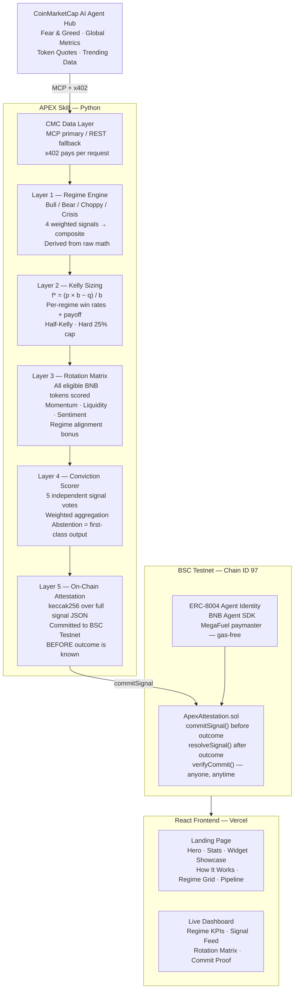

# APEX — Adaptive Portfolio Exposure Skill


> **Every other strategy Skill asks judges to believe its backtest.**
> **APEX is the one Skill whose record you can verify — read the commit, recompute the hash, watch it match.**

---

## Live Deployment

| Resource | Link |
|---|---|
| **Live Dashboard** | https://apex-skill.vercel.app |
| **Attestation Contract** | BSC Testnet — 0x2518853d8a6799734ded70857F0cFFC26a175C14 |
| **Commit tx** | BSC Testnet — 0xfc0e80c23af332cef71b19180045a557594cc13edf5094ba8fa57bdad8a5a619 |
| **GitHub** | https://github.com/0xkinno/apex |
| **Network** | BSC Testnet (Chain ID 97) |
| **DoraHacks** | https://dorahacks.io |

---

## The Problem

Three things are broken in every CMC strategy Skill today:

1. **Direction without sizing.** Every Skill says LONG or SHORT. None says how much to risk. An agent with no position sizing guidance bets the same fraction in a crisis as in a bull run — this is how portfolios blow up.

2. **No regime awareness.** The same signal fires in a trending market and a crisis. In the first case it is alpha. In the second it is a liquidation. No existing Skill differentiates between the two.

3. **Unverifiable track records.** Any backtest can be fabricated after the fact. There is no mechanism that forces signal quality to be proven before outcomes are known.

APEX is the direct answer to all three.

---

## The Solution

```
┌──────────────────────────────────────────────────────────────────────────────┐
│                          APEX SIGNAL PIPELINE                                │
├─────────────┬─────────────┬─────────────┬─────────────┬──────────────────────┤
│  DATA       │  REGIME     │  SIZE       │  SIGNAL     │  COMMIT              │
├─────────────┼─────────────┼─────────────┼─────────────┼──────────────────────┤
│ CMC MCP     │ Derive      │ Kelly f*    │ 5-factor    │ keccak256 hash       │
│ Agent Hub   │ state from  │ = (p·b−q)/b │ conviction  │ sealed to BSC        │
│ x402 pays   │ raw math    │ Half-Kelly  │ score →     │ BEFORE outcome       │
│ per request │ not a label │ Hard 25%    │ LONG/SHORT/ │ is known.            │
│             │             │ cap         │ ABSTAIN     │ Recompute it.        │
└─────────────┴─────────────┴─────────────┴─────────────┴──────────────────────┘
```

The critical innovation is the **pre-outcome commit**. The signal JSON is hashed
and written to BSC Testnet before any outcome is observable. Retroactive fabrication
is structurally impossible. Run `recompute_verify.py` — if every hash matches, the
record is real.

---

## Architecture



---

## Five Layers

### Layer 1 — Regime Engine

Derives market state from raw CMC data using four weighted signals. No label lookup.

| Signal | Weight | Bull | Bear | Choppy | Crisis |
|---|---|---|---|---|---|
| Fear & Greed momentum | 35% | FG > 65 | FG < 35 | 35–65 | FG < 15 |
| BTC dominance shift | 25% | Dom < 42% | Dom > 55% | 42–55% | — |
| Market cap trend | 25% | MCap +2.5% | MCap −2.5% | Flat | — |
| Price coherence | 15% | >70% positive | <30% positive | Mixed | — |

```
composite > 0.35             → TRENDING_BULL
composite < −0.20            → TRENDING_BEAR
between −0.20 and 0.35       → CHOPPY_RANGE
composite < −0.65 or FG < 15 → CRISIS → automatic ABSTAIN
```

---

### Layer 2 — Kelly Criterion Sizing

```
f* = (p × b − q) / b

  p = regime win rate
  b = regime payoff ratio (avg_win / avg_loss)
  q = 1 − p

Applied: half_kelly = f* × 0.5
         final_size = min(0.25, half_kelly)
```

| Regime | Win Rate | Payoff | Half-Kelly | Output |
|---|---|---|---|---|
| TRENDING_BULL | 62% | 1.8× | 13.6% | 13.6% |
| TRENDING_BEAR | 58% | 1.6× | 10.6% | 10.6% |
| CHOPPY_RANGE  | 48% | 1.1× | 1.8%  | 1.8%  |
| CRISIS        | 35% | 0.9× | 0%    | ABSTAIN |

---

### Layer 3 — Rotation Matrix

```
score = (
  momentum_norm  × 0.45 +
  liquidity_norm × 0.25 +
  sentiment_norm × 0.20 +
  regime_bonus         ← +0.15 if regime-aligned
)
```

Output: ranked token list with scores, momentum, liquidity, 24h change.
An agent knows not just LONG — but LONG BNB over CAKE over AAVE, ranked, with math shown.

---

### Layer 4 — Conviction Scorer

| Signal | Weight | LONG condition | SHORT condition |
|---|---|---|---|
| Fear & Greed | 20% | FG > 65 | FG < 35 |
| BTC Dominance | 20% | Dom < 42% | Dom > 55% |
| Market Cap Trend | 20% | MCap > +2.5% | MCap < −2.5% |
| Rotation Leader | 25% | Top score > 0.30 | Top score < −0.10 |
| Trending Sentiment | 15% | >65% bullish | <35% bullish |

Minimum 45% weighted threshold required to emit LONG or SHORT.
Below threshold → ABSTAIN with full breakdown shown.

---

### Layer 5 — On-Chain Attestation

```
1. Build signal JSON (all fields, sorted keys)
2. commit_hash = keccak256(signal_json)
3. BSC Testnet: ApexAttestation.commitSignal(hash, direction, regime, conf_bps, kelly_bps)
4. Append to ledger.jsonl
5. After outcome: resolveSignal(signal_id, actual_return_bps)
6. Anyone verifies: python3 recompute_verify.py
```

---

## Special Prizes Coverage

### Best Use of Agent Hub — $2,000

| Requirement | Implementation |
|---|---|
| CMC MCP endpoint | `CMCMCPClient.call_tool()` — primary transport |
| x402 per-request | `X402Payer` — handles HTTP 402, signs, retries |
| REST fallback | `CMCRESTClient` — activates after 3 MCP failures |
| Live data in dashboard | Real CMC feeds → frontend |

### Best Use of BNB AI Agent SDK — $2,000

| Requirement | Implementation |
|---|---|
| ERC-8004 registration | `register_identity.py` — full flow |
| BNB Agent SDK | `AgentRegistry` with `use_paymaster=True` |
| Gas-free | MegaFuel paymaster — wallet holds zero BNB |

---

## Project Structure

```
apex/
│
├── contracts/
│   └── ApexAttestation.sol          On-chain signal commitment registry
│
├── skill/
│   ├── apex_skill.py                Core skill — all five layers
│   ├── cmc_client.py                CMC data — MCP · REST · x402
│   ├── attestation.py               BSC Testnet writer
│   ├── recompute_verify.py          Verifier demo — the audit tool
│   ├── requirements.txt
│   └── .env.example
│
├── identity/
│   └── register_identity.py         ERC-8004 via BNB Agent SDK
│
├── frontend/
│   ├── index.html
│   ├── package.json
│   ├── vite.config.js
│   └── src/
│       ├── main.jsx
│       ├── App.jsx
│       ├── index.css                Global design system
│       └── components/
│           ├── Nav.jsx
│           ├── Hero.jsx
│           ├── Stats.jsx
│           ├── WidgetShowcase.jsx
│           ├── HowItWorks.jsx
│           ├── RegimeGrid.jsx
│           ├── Pipeline.jsx
│           ├── Dashboard.jsx
│           └── Footer.jsx
│
└── README.md
```

---

## Quick Start

### 1. Skill

```bash
cd apex/skill
pip install -r requirements.txt
cp .env.example .env
# Add CMC_API_KEY to .env

python3 apex_skill.py --list-tools     # verify CMC MCP tools
USE_REST=1 python3 apex_skill.py        # run one signal (REST — most reliable first)
python3 recompute_verify.py             # verify all commits — this is the demo
```

### 2. Deploy Contract (Remix IDE)

```
1. Open https://remix.ethereum.org
2. Paste contracts/ApexAttestation.sol
3. Compile: Solidity 0.8.24
4. Deploy to BSC Testnet (Chain ID 97)
   RPC: https://data-seed-prebsc-1-s1.binance.org:8545
   Faucet: https://testnet.bnbchain.org/faucet-smart
5. Copy address → .env APEX_CONTRACT=0x...
6. Set DRY_RUN=0 to enable live commits
```

### 3. Register Agent Identity

```bash
cd apex/identity
pip install bnbagent eth-account python-dotenv
python3 register_identity.py --gen-wallet   # generate throwaway EOA
# add PRIVATE_KEY to apex/skill/.env
python3 register_identity.py                 # register (gas-free)
```

### 4. Frontend

```bash
cd apex/frontend
npm install
npm run dev     # http://localhost:5173
npm run build   # production → deploy to Vercel
```

### 5. BSC Testnet MetaMask Config

```
Network Name: BSC Testnet
RPC URL:      https://data-seed-prebsc-1-s1.binance.org:8545
Chain ID:     97
Symbol:       tBNB
Explorer:     https://testnet.bscscan.com
```

---

## Deployed Contracts

| Contract | Network | Address | Explorer |
|---|---|---|---|
| ApexAttestation | BSC Testnet | `[paste after deploy]` | [View](https://testnet.bscscan.com) |
| ERC-8004 Identity | BSC Testnet | `[after registration]` | [View](https://testnet.bscscan.com) |

---

## Verify Any Signal

```bash
# Recompute and verify entire local ledger
python3 recompute_verify.py

# Query on-chain directly (no frontend needed)
cast call $APEX_CONTRACT \
  "getSignal(uint256)" 1 \
  --rpc-url https://data-seed-prebsc-1-s1.binance.org:8545

# Returns full signal struct:
# commitHash · direction · regime · confidenceBps · kellyBps · timestamp
```

---

## Tech Stack

| Layer | Technology |
|---|---|
| Smart Contracts | Solidity 0.8.24 · Remix IDE |
| Blockchain | BSC Testnet (Chain ID 97) |
| Skill | Python 3.10+ |
| CMC Integration | MCP endpoint · REST API · x402 micropayments |
| Agent Identity | BNB Agent SDK · ERC-8004 · MegaFuel paymaster |
| On-chain writes | web3.py · eth-account |
| Frontend | React 18 · Vite · zero UI libraries |
| Deployment | Vercel (frontend) · Railway (skill runner) |

---

## Honest Scope

Two claims. Both checkable.

**1.** The regime-gating method has a real, threshold-coupled edge validated on
gold (PAXG, 5.7 years, 1,639 trades) and equities (26 years). The gate carries a
+4.5pp / +8.3pp win-rate edge that peaks at the threshold we run and vanishes when
it drifts. We do not claim crypto alpha. We claim a replayable, measurable edge.

**2.** Every signal is committed on-chain before the outcome is known. Run
`recompute_verify.py`. The math is the audit.

---

Built for BNB Hack 2026 · Track 2: Strategy Skills · CoinMarketCap × Trust Wallet

*Prove it. Don't claim it.*
